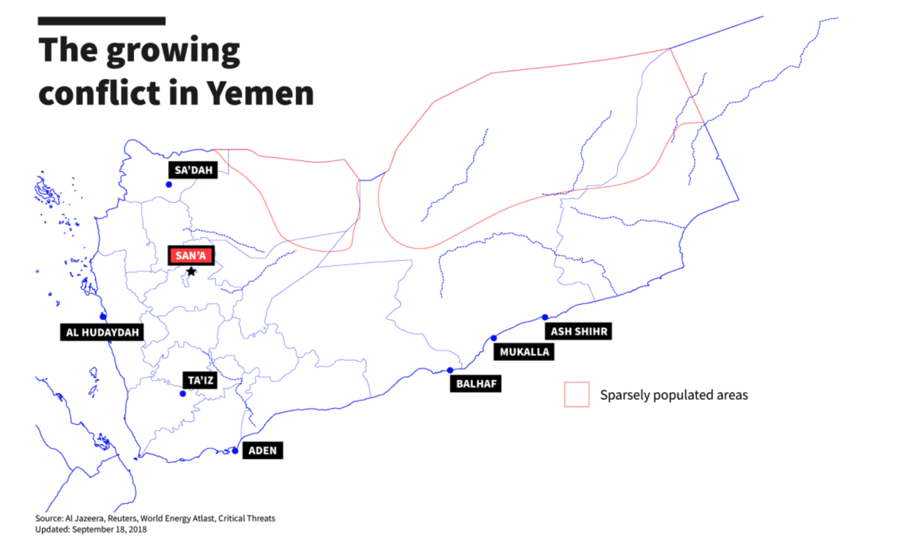

# The Conflict in Yemen: Predicting Civilian Casualties
Team: Max Bermont, Eileen Hartnett, Garrett Nelson

### Contents:
- [Problem Statement](#Problem-Statement)
- [Background](#Background)
- [Data Source](#Data-Source)
- [Data Dictionary](#Data-Dictionary)
- [Project Repo Contents](#Project-Repo-Contents)
- [Conclusions and Recommendations](#Conclusions-and-Recommendations)
- [References](#References)

### Problem Statement 

Yemen is currently experiencing one of the world’s worst humanitarian crises. More than three and a half million people have been displaced by the ongoing conflict. Millions of people depend on humanitarian assistance for survival.

Doctors Without Borders/Médecins Sans Frontières (MSF) has treated over 119,000 people with injuries related to the war since March 2015. However, insecurity and access constraints prevented them from collecting reliable data on the humanitarian needs across the country.

Using an open source dataset produced by The Yemen Data Project, **we aim to build a model that predicts the number of civilian casualties to expect if a certain area is attacked.** This information will provide a more accurate prediction of how much aid to allocate towards medical resources, funding, and personnel based on location of the attack.  

### Background:

The conflict in Yemen, a complicated civil war influenced by foreign actors, roots back to the Arab Spring in 2011. The uprising led to the removal of the authoritarian president, Ali Abdullah Saleh, who handed power over to Abdrabbuh Mansour Hadi. The transition however did not bring stability to Yemen. In 2014 the Houthi Shia Muslim group seized control of the northern Saada region, and the capital Sanaa, forcing President Hadi into exile. In 2015, a Saudi Arabian-led coalition, backed by the US, UK, and France, commenced air strikes against the Houthis. The Saudi-led coalition feared that Iran, which is a Shia-majority state,  was backing the Houthi rebellion, a claim that Iran denied. Within Yemen, divisions deepened. On the anti-Houthi side, militias include separatists seeking independence for south Yemen and factions who oppose the idea. Since the airstrikes began in 2015, more than 233,000 people have died and more than 20 million Yemenis are at risk of famine. 

**The role of Doctors Without Borders/Médecins Sans Frontières (MSF) in Yemen:**

Doctors Without Borders/Médecins Sans Frontières (MSF) medical projects in Yemen are among their biggest worldwide. 

The following text is from the [Doctors Without Borders website](https://www.doctorswithoutborders.org/what-we-do/countries/yemen#How%20we%E2%80%99re%20helping%20people%20caught%20in%20Yemen%E2%80%99s%20humanitarian%20crisis)

As an organization providing medical aid to people in Yemen, MSF worked in 13 hospitals and health centers and provided support to more than 20 health facilities across 12 governorates in 2018. However, repeated attacks on medical staff and structures during the year forced us to suspend activities in several areas.

Insecurity and access constraints also prevented us—and other organizations—from collecting reliable data on the nutritional and humanitarian needs across the country. Our teams treated 5,700 children for malnutrition across Hajjah, Sa’ada, Amran, Ibb, and Taiz governorates, but saw no signs of impending famine—contrary to what the UN and others were suggesting.

### Data Source

**The data:**

The following link is from the Yemen Data Project, providing a brief background on the current conflict and an overview of the dataset:  https://yemendataproject.org/data.html 

**Data Collection Methodology:** 

The following link is from the Yemen Data Project, explaining their methodology for collecting air raid and civilian casualty data: https://yemendataproject.org/methodology-1.html

### Data Dictionary

|Feature|Data type|Description|
|---|---|---|
|incident_id|int64|unique attack identifier|
|governorate|object|city attacked|
|district|object|district in city|
|area|object|area attacked|
|target|object|target attacked|
|main_category|object|category of attacked target|
|sub_category|object|sub-category of attacked target|
|min_air_raids|float64|min Air attacks|
|max_air_raids|float64|max Air attacks|
|civilian_casualties|int64|fatalities and injuries combined|
|fatalities|int64|number of deaths|
|woman_fatalities|int64|number of female deaths|
|child_fatalities|int64|number of child deaths|
|injured|int64|number of injuries|
|woman_injured|int64|number of women injured|
|child_injured|float64|number of children injured|
|confirmed_time|object|hour of the attack|
|time_of_day|object|morning, afternoon, or night|

### Project Repo Contents
- [Raw Data](./data/raw_yemen_data.csv)
- [Clean Data](./data/clean_df.csv)
- [Data Cleaning Notebook](./main_notebooks/data_clean.ipynb)
- [EDA Notebook](./main_notebooks/eda_notebook.ipynb)
- [Modeling Notebook - Neural Network](./main_notebooks/modeling_neural_network_casualties.ipynb)
- [Modeling Notebook - ARIMA](./main_notebooks/modeling_arima.ipynb)
- [Modeling Notebook - Neural Network looking at Governorate](./main_notebooks/modeling_neural_network_governorate.ipynb)
- [Modeling Notebook - Random Forest](./main_notebooks/modeling_random_forest.ipynb)
- [Plots and Images](./images)

### Conclusions and Recommendations
- We used a neural network model to predict the number of casualties in order to appropriately allocate aid as real time information on the ground may not be that accurate in the midst of a crisis.  

- Based on the data provided we are able to predict the number of casualties based on location hit with approximately 90% accuracy.

- We would recommend further research to look at the impact of landmines and IEDs on the number of casualties in order to improve accuracy in predicting aid allocation.

### References
https://yemendataproject.org/ 

https://www.bbc.com/news/world-middle-east-44466574

https://www.npr.org/2021/02/08/965497266/critic-of-u-s-role-in-yemen-responds-to-bidens-plans-to-pull-back 

https://interactive.aljazeera.com/aje/2018/Saudi-Arabia-air-raids-on-Yemen/index.html#2019

https://www.doctorswithoutborders.org/what-we-do/countries/yemen#How%20we%E2%80%99re%20helping%20people%20caught%20in%20Yemen%E2%80%99s%20humanitarian%20crisis

